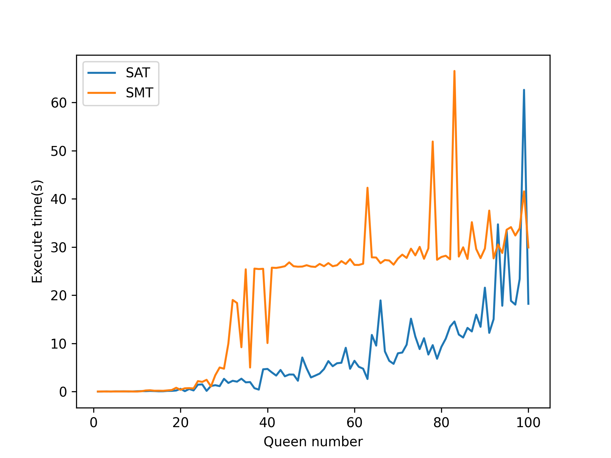
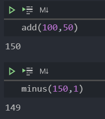
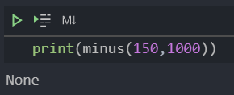

[TOC]

## 作业1

### N皇后

#### SMT

以下代码内容来自老师PPT，基本流程就是先约束每个Queen坐标的列坐标取值范围`val_c`，再通过`col_c`约束每个列上不会有两个Queen，最后通过`diag_c`约束对角线。

```python
def n_queen_smt(n = 8):
    Q = [Int('Q_%i' % (i + 1)) for i in range(n)]
    val_c = [And(1 <= Q[i], Q[i] <= n) for i in range(n)]
    col_c = [Distinct(Q)]
    diag_c = [If(i == j, True, And(i+Q[j]!=j+Q[i], i-Q[j]!=j-Q[i])) for i in range(n) for j in range(i)]

    time_start=time.perf_counter()
    solve(val_c + col_c + diag_c)
    time_end=time.perf_counter()
    print('time cost for smt:',time_end-time_start,'s')
```

#### SAT

以下代码基本流程

1. 对N queen问题中，$n*n$棋盘的每个格子定义一个变量$Q_{n,n}$
2. 先约束每行有且仅有一个格子为1，例如一行有$a_1,a_2,a_3$三个格子通过$(\neg(\neg a_1\or a_2\or a_3)\or\neg(a_1\or \neg a_2\or a_3)\or\neg(a_1\or a_2\or \neg a_3)) $来保证约束成立
3. 再通过与上述方法相同的思路约束列`col_c`
4. 最后类似思路通过`diag_c`约束对角线没有冲突，但是由于可能一条对角线上没有皇后，所以需要增加一个$\neg(\or Q_{ij})$约束，其中$i,j$对应对角线元素。

```python
def n_queen_sat(n = 8):
    Q = [Bool('Q_%i%i' % (i + 1, j + 1)) for i in range (n) for j in range(n)]
    row_c = And([Or([Not(Or([If(i==k, Not(Q[j*n+i]), Q[j*n+i]) for i in range(n)])) for k in range(n)]) for j in range(n)])  #每一行有且仅有一个为True
    col_c = And([Or([Not(Or([If(j==k, Not(Q[j*n+i]), Q[j*n+i]) for j in range(n)])) for k in range(n)]) for i in range(n)])  #每一列有且仅有一个为True
    outer1 = []
    outer2 = []
    for j in range(2*n-1):#0-6
        inner = []
        literal = []
        for i in range(n):
            if(j-i < n and j-i >=0):
                literal += [Q[(j-i)*n+i]]
        outer_list = [Not(Or(literal))]
        for a in range(len(literal)):
            inner_list = []
            for b in range(len(literal)):
                if(b == a):
                    inner_list += [Not(literal[b])]
                else:
                    inner_list += [literal[b]]
            outer_list += [Not(Or(inner_list))]
        outer1 += [Or(outer_list)]
    for j in range(-n+1,n):#0-3
        inner = []
        literal = []
        for i in range(n):
            if(j+i < n and j+i >= 0):
                literal += [Q[(j+i)*n+i]]
        outer_list = [Not(Or(literal))]
        # print(literal)
        for a in range(len(literal)):
            inner_list = []
            for b in range(len(literal)):
                if(b == a):
                    inner_list += [Not(literal[b])]
                else:
                    inner_list += [literal[b]]
            outer_list += [Not(Or(inner_list))]
        outer2 += [Or(outer_list)]
    diag_c = And(And(outer1), And(outer2))

    time_start=time.perf_counter()
    solve(row_c + col_c + diag_c)
    time_end=time.perf_counter()
    print('time cost for smt:',time_end-time_start,'s')
```

#### 对比

可以看到在大多数情况下，pure SAT的效率要高于SMT，但是有时候SAT求解会出现较大抖动。**总体上来说SAT求解的效率要高于SMT**，这可能是由于SMT转换为SAT时需要花费一定时间，而且SMT转换为SAT后可能变量个数要多于pure SAT，所以效率低于pure SAT。

不过图中的时间仅仅包含`solve`函数的执行时间。如果将前面的数据预处理部分一起加入，pure SAT花费的时间要多于SMT，这大概是因为我自己写的pure SAT约束生成部分效率较低，用了很多`for`循环，所以花费时间比SMT中自带的转换器慢。



## 作业2

**由于观察到减法`a-b=d`可以转化为`a=b+d`，所以加法和减法实际上是一个东西，所以我就先实现了加法，后在加法基础上进行修改得到减法**

### 加法

由于a，b的二进制位数可能不相同，所以需要按照最长位数补齐。

其它关于代码内容在注释中

```python
def add(a = 20, b = 7):
    max_len = max(len("{0:b}".format(a)), len("{0:b}".format(b)))+1
    format_str = '{0:0'+str(max_len)+'b}'
    a_bin = format_str.format(a)
    b_bin = format_str.format(b)
    # 数据预处理，将A B补足到相同位数
    A = [Bool('a_%i' % (i + 1)) for i in range (max_len)]
    B = [Bool('b_%i' % (i + 1)) for i in range (max_len)]
    C = [Bool('c_%i' % i) for i in range (max_len + 1)]
    D = [Bool('d_%i' % (i + 1)) for i in range (max_len)]
    # 采用舍去D的最高位的方式计算
    # 变量定义
    A_c = And([If(a_bin[i] == '0', Not(A[i]), A[i]) for i in range(max_len)])	# 将A的二进制数字形式化为表达式
    B_c = And([If(b_bin[i] == '0', Not(B[i]), B[i]) for i in range(max_len)])	# 将B的二进制数字形式化为表达式
    D_c = And([D[i]==(A[i]==(B[i]==C[i+1])) for i in range(max_len)])	# 约束A[i],B[i],C[i],D[i]间关系
    Carry_c = And([C[i]==Or(And(A[i], B[i]), And(A[i], C[i+1]), And(B[i], C[i+1])) for i in range(max_len)])	# 约束进位关系
    s = Solver()
    s.add(A_c, B_c, D_c, Carry_c, Not(C[0]), Not(C[max_len]))
    result = s.check()
    # 输出计算结果
    if result == sat:
        d = ""
        for i in range(max_len):
            if s.model()[D[i]] == True:
                d += '1'
            else:
                d += '0'
        print(int(d, 2))
        return int(d, 2)
   	return None
```

### 减法

大部分代码思路和加法一致，只不过在`A[i],B[i],C[i],D[i]`间关系的约束和进位的约束需要稍作修改

```python
def minus(a = 20, b = 7):
    # a - b = d implies a = b + d
    max_len = max(len("{0:b}".format(a)), len("{0:b}".format(b)))
    format_str = '{0:0'+str(max_len)+'b}'
    a_bin = format_str.format(a)
    b_bin = format_str.format(b)
    A = [Bool('a_%i' % (i + 1)) for i in range (max_len)]
    B = [Bool('b_%i' % (i + 1)) for i in range (max_len)]
    C = [Bool('c_%i' % i) for i in range (max_len + 1)]
    D = [Bool('d_%i' % (i + 1)) for i in range (max_len)]
    A_c = And([If(a_bin[i] == '0', Not(A[i]), A[i]) for i in range(max_len)])
    B_c = And([If(b_bin[i] == '0', Not(B[i]), B[i]) for i in range(max_len)])
    # 以上内容和加法相同
    # 以下内容唯一不同在于由于d=a-b⇔a=b+d，所以需要把加法中的a换成b，d换成a
    D_c = And([A[i]==(D[i]==(B[i]==C[i+1])) for i in range(max_len)])
    Carry_c = And([C[i]==Or(And(D[i], B[i]), And(D[i], C[i+1]), And(B[i], C[i+1])) for i in range(max_len)])
    s = Solver()
    s.add(A_c, B_c, D_c, Carry_c, Not(C[0]), Not(C[max_len]))
    result = s.check()
    if result == sat:
        d = ""
        for i in range(max_len):
            if s.model()[D[i]] == True:
                d += '1'
            else:
                d += '0'
        print(int(d, 2))
        return int(d, 2)
	return None
```

### 代码使用

`add(a, b)`和`minus(a, b)`均为两个函数，输入值为`a`和`b`，在加法中两者顺序无所谓，在减法中`minus(a,b)`表示计算`a-b`的结果并打印到显示器上，返回值为计算得到的10进制结果，如果计算失败则返回None。

直接调用`add()`或`minus()`，其中`a,b`默认为20和7，作为示例和测试用途。

### 实验结果

最终加法和减法都能够正常运行，运行结果如下



如果减法出现负数，则会运行失败，返回None



