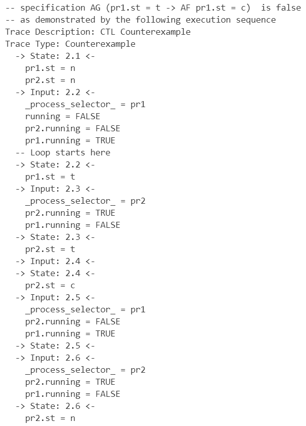
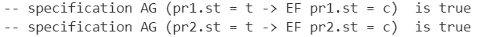

### Lab2

### source code

程序介绍见代码中的注释，CTL表达式在后面会讲解

```
MODULE main
    VAR
    -- 定义两个process,由process的性质保证每次只有一个process active
    pr1: process prc(pr2.st);
    pr2: process prc(pr1.st);
    
    -- Safety
    CTLSPEC
        AG(!((pr1.st = c) & (pr2.st = c)))
    -- Liveness
    CTLSPEC
        AG((pr2.st = t) -> AF(pr2.st = c))
    CTLSPEC
        AG((pr1.st = t) -> AF(pr1.st = c))
    -- Non-blocking
    CTLSPEC
        AG((pr1.st = t) -> EF(pr1.st = c))
    CTLSPEC
        AG((pr2.st = t) -> EF(pr2.st = c))
    -- No Strict Sequencing
    CTLSPEC
        AG((pr1.st = c) -> AG( pr1.st = c | E[pr1.st = c U (pr1.st != c & AG pr1.st != c | ((pr1.st != c | E[(pr1.st != c) U pr2.st = c])))]))

MODULE prc(other-st)
    VAR
        st : {n, t, c};
    ASSIGN
        -- 初始状态为n
        init(st) := n;
        next(st) :=
            case
                -- 当前状态为n的时候,下一个状态为t
                (st = n) : t;
                -- 当前状态为t且另一个process不在critical area时,下一个状态为c
                (st = t) & (other-st != c) : c;
                -- 当前状态为c时,下一个状态为n
                (st = c) : n;
                -- 其它情况下保持不变
                TRUE : st;
            esac;
```

### Safety

保证两个进程不会同时进入c

`AG(!((pr1.st = c) & (pr2.st = c)))`

对于起始点出发的所有的节点，不存在使得pr1.st和pr2.st都在c状态的情况

#### 结果


### Liveness

`AG((pr2.st = t) -> AF(pr2.st = c))`

`AG((pr1.st = t) -> AF(pr1.st = c))`

对于所有从起始点出发的所有节点，都要满足当pr1.st=t的情况下，之后存在一个状态使得pr1进入c状态

#### 结果

存在当pr2在n->t->c->n->t->...状态之间来回转换的时候，pr1将永远得不到执行，所以Liveness不满足



### Non-blocking

`AG((pr1.st = t) -> EF(pr1.st = c))`

`AG((pr2.st = t) -> EF(pr2.st = c))`

对于所有从起始点出发的所有节点，当某个进程进入t状态后，之后存在某个状态使得该进程转移进入c状态

#### 结果



### No strict sequencing

emmmm 不太会

但应该是正确的（