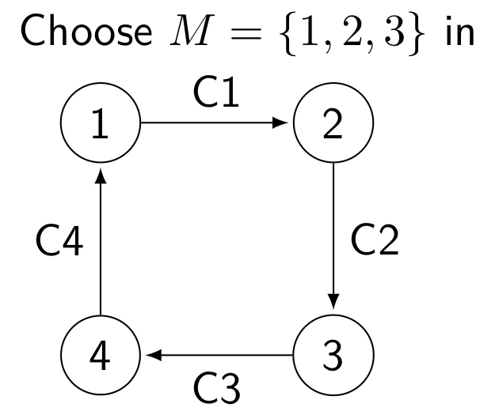
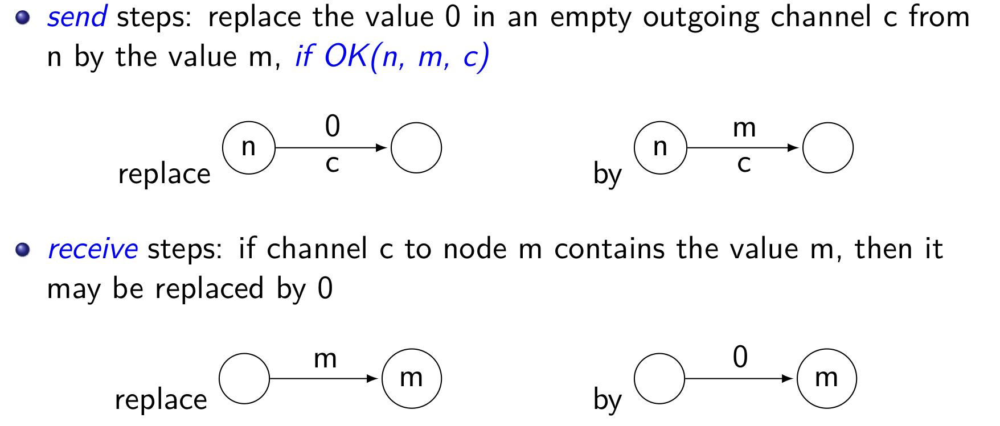
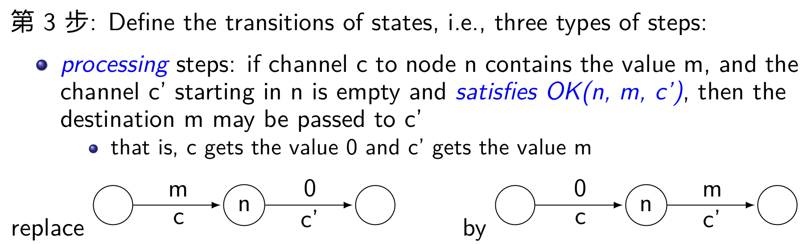
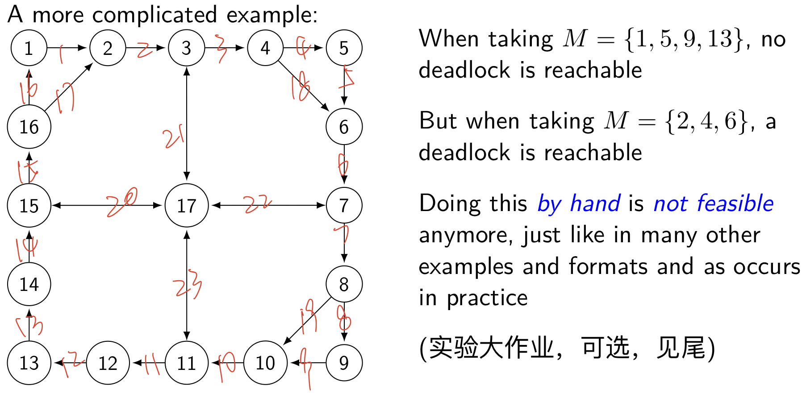
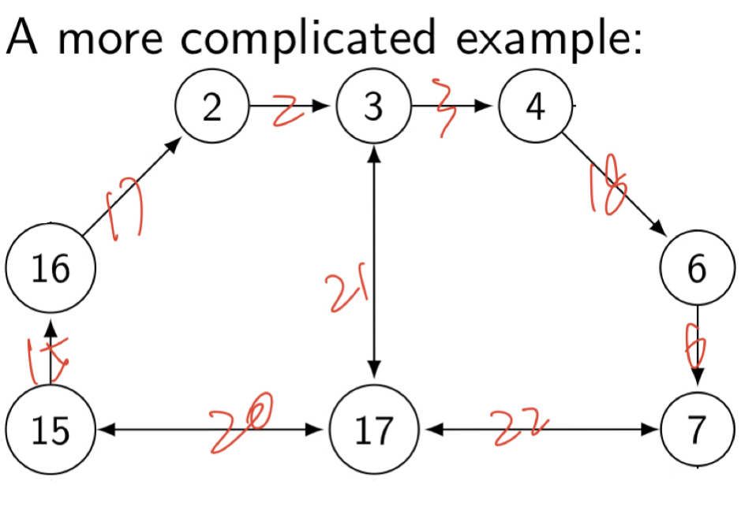
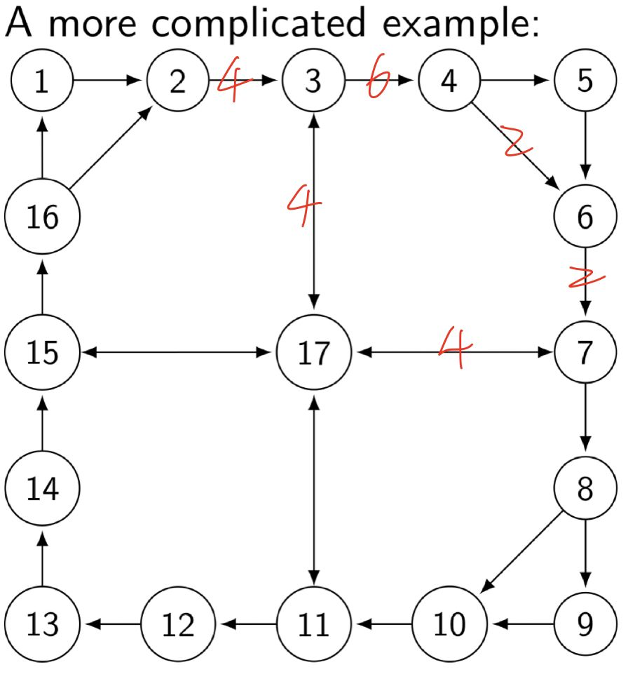
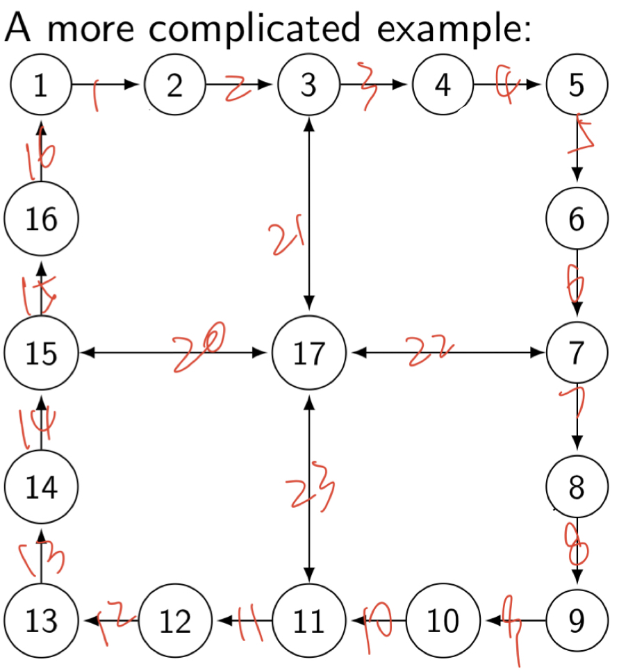
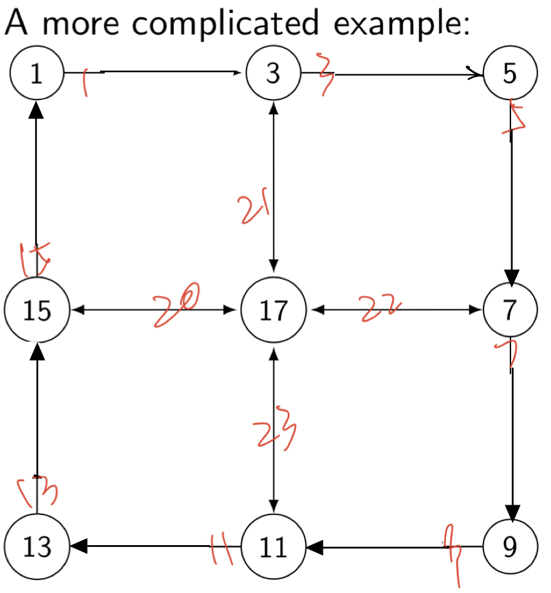
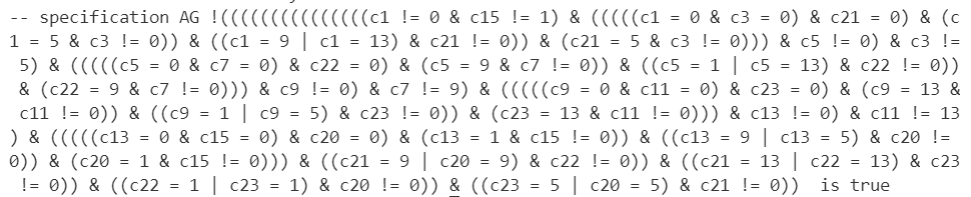

# Deadlock验证实验

[TOC]

## 实验要求

> 实现PPT中的deadlock验证，并针对complicated example中所给的结论进行验证

## PPT中的deadlock验证

### 要求

+ 只有$M=\{1,2,3\}$这些节点能够收发消息。
+ 一个节点可以接受发送给自己的消息
+ 一个节点可以转发一条消息到一个空信道上
+ 一个节点可以向一个空信道发送一条消息
+ 要选择最短路径



### 基本想法

1. 在这个简单例子中，从一个节点到另一个节点的最短路线只有一个，所以无需特意选择最短路径。
2. 出现deadlock的状态时，不可能出现一个节点的in信道内有给它的信息（因为这样这个节点就可以receive这个信息，和deadlock的定义冲突），所以当一个节点可以receive一条信息时，它必然可以直接receive。
3. 由于每个节点都能够自主选择send或者process，所以节点的state可以从send或者process中随机选择，（即使一个节点的in信道中有可以process的信息，该节点也有可能选择send一个新信息）。
4. 几种基本的状态转移如下





### 代码验证

**（该部分代码见附带的simple-model.smv）**

```python
MODULE main
    VAR
    c1: {0, 1, 2, 3, 4};
    c2: {0, 1, 2, 3, 4};
    c3: {0, 1, 2, 3, 4};
    c4: {0, 1, 2, 3, 4};
    -- 不允许给4发送消息
    -- pr1只允许给2,3发消息,以此类推
    pr1: process node(c4, c1, 0, 1, {2, 3}, TRUE);
    pr2: process node(c1, c2, 0, 2, {1, 3}, TRUE);
    pr3: process node(c2, c3, 0, 3, {2, 1}, TRUE);
    pr4: process node(c3, c4, 0, 4, {2, 3, 1}, FALSE);
    ASSIGN
    -- 初始化所有信道为空
    init(c1) := 0;
    init(c2) := 0;
    init(c3) := 0;
    init(c4) := 0;
    next(c1) := c1;
    next(c2) := c2;
    next(c3) := c3;
    next(c4) := c4;
    CTLSPEC
        -- 在所有情况下都不可能出现所有信道均不为空,
        -- 并且所有节点都无法receive信息
        AG(!(c1!=0&c1!=2&c2!=0&c2!=3&c3!=0&c3!=4&c4!=0&c4!=1))

MODULE node(from, to, e, id, mlist, allow)
    FAIRNESS running
    VAR
        st : {send, proc};
    ASSIGN
        -- 一个节点状态可以是send或者process
        init(st) := {send, proc};
        next(st) := {send, proc};
        next(from) :=
        case
            -- 如果有可以接收的信息则进行接收
            (from = id) : e;
            -- 如果当前状态为process状态,并且有信息可以转发,则进行转发,讲from设为empty
            (from != e & from != id & to = e & st = proc) : e;
            TRUE : from;
        esac;
        next(to) :=
        case
            -- 如果当前状态为send,则随机向一个node发送一条信息
            (to = e & allow = TRUE & st = send) : mlist;
            -- 如果当前状态为process状态,并且有信息可以转发,则让to=from
            (from != e & from != id & to = e & st = proc) : from;
            TRUE : to;
        esac;
```

### 运行结果

对deadlock约束进行验证，NuSMV给出无法满足约束的结果。

```python
-- specification AG !(((((((c1 != 0 & c1 != 2) & c2 != 0) & c2 != 3) & c3 != 0) & c3 != 4) & c4 != 0) & c4 != 1)  is false
-- as demonstrated by the following execution sequence
Trace Description: CTL Counterexample        
Trace Type: Counterexample 
  -> State: 1.1 <-
    c1 = 0
    c2 = 0
    c3 = 0
    c4 = 0
    pr1.st = send
    pr2.st = send
    pr3.st = send
    pr4.st = send
  -> Input: 1.2 <-
    _process_selector_ = pr1
    running = FALSE
    pr4.running = FALSE
    pr3.running = FALSE
    pr2.running = FALSE
    pr1.running = TRUE
  -> State: 1.2 <-
    c1 = 3
  -> Input: 1.3 <-
    _process_selector_ = pr2
    pr2.running = TRUE
    pr1.running = FALSE
  -> State: 1.3 <-
    c2 = 1
  -> Input: 1.4 <-
    _process_selector_ = pr3
    pr3.running = TRUE
    pr2.running = FALSE
  -> State: 1.4 <-
    c3 = 2
  -> Input: 1.5 <-
    _process_selector_ = pr4
    pr4.running = TRUE
    pr3.running = FALSE
  -> State: 1.5 <-
    pr4.st = proc
  -> Input: 1.6 <-
  -> State: 1.6 <-
    c3 = 0
    c4 = 2
    pr4.st = send
  -> Input: 1.7 <-
    _process_selector_ = pr3
    pr4.running = FALSE
    pr3.running = TRUE
  -> State: 1.7 <-
    c3 = 1
```

从状态转移中可以翻译得到如下信息

1. send(1,3): C1=3
2. send(2,1): C2=1
3. send(3,2): C3=2
4. process C4: C4=2, C3=0
5. send(3,1): C3=1

此时发生死锁，和PPT中的例子完全相同，可见代码的正确性。

## complicated example验证

### 要求



### 基本想法

从图中可以知道，一共有5种不同的节点类型，分别是

1. 一进一出（例如1）
2. 两进一出（例如2）
3. 一进两出（例如4）
4. 一进一出，外加一个可进可出（例如3）
5. 四个方向均可进出（例如17）

一个自然的想法就是为五种节点分别构造五种不同的process，为每种process提供接收的发送的状态转移。

### first-attempt

使用这种方式可以自然定义每个节点的收发状态以及状态转移（**代码见first-attempt.smv**），但是，这样会对整个系统造成很多状态冗余，例如$M=\{2, 4, 6\}$的时候，节点1并不需要存在发送状态，因为它本身就不可能接收或者发送任何信息。

**我一开始构造了五种不同的process，但是由于搜索空间太大，到目前为止（大约十几个小时），电脑还是没有跑出结果**

### second-attempt

接下来就需要对每个状态分开写状态机，裁剪不需要的状态，简化整个机器的状态转移。

1. 裁剪了非收发节点的send状态
2. 由于采用最短路径转发，所以裁剪了永远不可能走到的信道和节点状态
3. 经过上述两步裁剪后，针对发送的信息可以进一步裁剪，例如node A有两条出路（a和b），当信息为m1的时候，a距离更近，则此时m1必须选择a出口

经过以上3步的裁剪，就可以解决$M=\{2,4,6\}$的问题了

### $M=\{2,4,6\}$求解


在该状态下基于以下几点可以进行裁剪

先计算各个消息的传播最短路径

+ 2->4: 2-3-4
+ 2->6: 2-3-4-6
+ 4->6: 4-6
+ 4->2: 4-6-7-17-15-16-2
+ 6->2: 6-7-17-15-16-2
+ 6->4: 6-7-17-3-4

从以上状态转移中，我们可以裁剪掉node 1, 5, 8, 9, 10, 11, 12, 13, 14

得到的结果如下



经过简化可以大大减小状态数

观察状态图还能得到另外几点观察

+ node 7, 15, 16相当于单向process的节点
+ node 2, 4, 6是能够收发信息的单向节点
+ node 3永远不会向node 17发送信息，但会从node 17接收信息
+ 当m(channel 22)=2时，node 17向node 15发送信息；m(channel 22)=4或6时，node 17向node 21发送信息

编写如下的smv代码用于约束每个节点**(同样的代码见problem2.smv)**

```python

-- 一进一出
MODULE node_type1(from, to, id)
    FAIRNESS running
    ASSIGN
        next(from) :=
        case
            -- 只进行转发
            (from != 0 & from != id & to = 0) : 0;
            TRUE : from;
        esac;
        next(to) :=
        case
            (from != 0 & from != id & to = 0) : from;
            TRUE : to;
        esac;

-- 一进一出带收发 for node 2 4 6
MODULE node_type1_1(from, to, id, mlist)
    FAIRNESS running
    VAR
        st : {send, proc, recv};
    ASSIGN
        init(st) := {send, proc, recv};
        next(st) := {send, proc, recv};
        next(from) :=
        case
            -- recv状态则接收一个和自己id相同的信息
            (from = id & st = recv) : 0;
            -- proc状态则向to信道转发from信道的消息
            (from != 0 & from != id & to = 0 & st = proc) : 0;
            TRUE : from;
        esac;
        next(to) :=
        case
            -- send状态则从mlist中挑出一个node,并发送信息到to信道
            (to = 0 & st = send) : mlist;
            (from != 0 & from != id & to = 0 & st = proc) : from;
            TRUE : to;
        esac;

-- node 17
MODULE node_type5(inout1, inout2, inout3, id)
    FAIRNESS running
    ASSIGN
        -- 当c22为2时,向c20转发信息
        next(inout1) :=
        case
            (inout3 = 2 & inout3 != id & inout1 = 0) : inout3;
            TRUE : inout1;
        esac;
        -- 当c22为4或6时,向c21转发信息
        next(inout2) :=
        case
            ((inout3 = 4 | inout3 = 6) & inout3 != id & inout2 = 0) : inout3;
            TRUE : inout2;
        esac;
        -- 信息转发后清空in信道
        next(inout3) :=
        case
            (inout3 != 0 & inout3 != id ) : 0;
            TRUE : inout3;
        esac;
```

使用如下代码定义节点之间的连接关系，以及每个信道的初始化

```python
MODULE main
    DEFINE
    -- 定义每个channel可以传送的信息范围
    VAR
    c2 : {0, 2, 4, 6};
    c3 : {0, 2, 4, 6};
    c6 : {0, 2, 4, 6};
    c15 : {0, 2, 4, 6};
    c17 : {0, 2, 4, 6};
    c18 : {0, 2, 4, 6};
    c20 : {0, 2, 4, 6};
    c21 : {0, 2, 4, 6};
    c22 : {0, 2, 4, 6};

    pr2: process node_type1_1(c17, c2, 2, {4, 6});
    pr3: process node_type1(c2, c3, 3);
    pr4: process node_type1_1(c3, c18, 4, {2, 6});
    pr6: process node_type1_1(c18, c6, 6, {2, 4});
    pr7: process node_type1(c6, c22, 7);
    pr15: process node_type1(c20, c15, 15);
    pr16: process node_type1(c15, c17, 16);
    pr17: process node_type5(c20, c21, c22, 17);
    -- 初始化每个channel为0(empty)
    ASSIGN
    init(c2) := 0;
    init(c3) := 0;
    init(c6) := 0;
    init(c15) := 0;
    init(c17) := 0;
    init(c18) := 0;
    init(c20) := 0;
    init(c21) := 0;
    init(c22) := 0;
    next(c2) := c2;
    next(c3) := c3;
    next(c6) := c6;
    next(c15) := c15;
    next(c17) := c17;
    next(c18) := c18;
    next(c20) := c20;
    next(c21) := c21;
    next(c22) := c22;
```

当每个节点均被block时（每个节点均无法接收、产生或转发消息），产生deadlock

block可以分为以下几类

+ 对于一个收发节点
  + 所有的**出边信道均被占用**并且**入边信道没有发送给自己的消息**
+ 对于一个中转节点
  + 所有的**入边均为空**
  + 入边中的消息对应的**最短路径的出边**被占用

所以对于每个节点建立约束

```python
CTLSPEC
    AG(!(
        -- node 2 blocked
        c2!=0&c17!=2&
        -- node 3 blocked
        c3!=0&c3!=4&
        -- node 4 blocked
        c18!=0&c3!=4&
        -- node 6 blocked
        c6!=0&c18!=6&
        -- node 7 blocked
        (c22!=0|(c22=0&c6=0))&
        -- node 15 blocked
        (c15!=0|(c15=0&c20=0))&
        -- node 16 blocked
        (c17!=0|(c17=0&c15=0))&
        -- node 17 blocked
        ((c21!=0&(c22=4|c22=6))|(c20!=0&c22=2)|(c22=0&c20=0&c21=0))
    ))
```

运行代码得到如下结果

```python
-- specification AG !(((((((((((c2 != 0 & c17 != 2) & c3 != 0) & c3 != 4) & c18 != 0) & c3 != 4) & c6 != 0) & c18 != 6) & (c22 != 0 | 
(c22 = 0 & c6 = 0))) & (c15 != 0 | (c15 = 0 & c20 = 0))) & (c17 != 
0 | (c17 = 0 & c15 = 0))) & (((c21 != 0 & (c22 = 4 | c22 = 6)) | (c20 != 0 & c22 = 2)) | ((c22 = 0 & c20 = 0) & c21 = 0)))  is false  
-- as demonstrated by the following execution sequence
Trace Description: CTL Counterexample
Trace Type: Counterexample
  -> State: 1.1 <-
    c2 = 0
    c3 = 0
    c6 = 0
    c15 = 0
    c17 = 0
    c18 = 0
    c20 = 0
    c21 = 0
    c22 = 0
    pr2.st = send
    pr4.st = send
    pr6.st = send
  -> Input: 1.2 <-
    _process_selector_ = pr2
    running = FALSE
    pr17.running = FALSE
    pr16.running = FALSE
    pr15.running = FALSE
    pr7.running = FALSE
    pr6.running = FALSE
    pr4.running = FALSE
    pr3.running = FALSE
    pr2.running = TRUE
  -> State: 1.2 <-
    c2 = 6
  -> Input: 1.3 <-
    _process_selector_ = pr6
    pr6.running = TRUE
    pr2.running = FALSE
  -> State: 1.3 <-
    c6 = 4
  -> Input: 1.4 <-
    _process_selector_ = pr7
    pr7.running = TRUE
    pr6.running = FALSE
  -> State: 1.4 <-
    c6 = 0
    c22 = 4
  -> Input: 1.5 <-
    _process_selector_ = pr6
    pr7.running = FALSE
    pr6.running = TRUE
  -> State: 1.5 <-
    c6 = 4
  -> Input: 1.6 <-
    _process_selector_ = pr17
    pr17.running = TRUE
    pr6.running = FALSE
  -> State: 1.6 <-
    c21 = 4
    c22 = 0
  -> Input: 1.7 <-
    _process_selector_ = pr7
    pr17.running = FALSE
    pr7.running = TRUE
  -> State: 1.7 <-
    c6 = 0
    c22 = 4
  -> Input: 1.8 <-
    _process_selector_ = pr6
    pr7.running = FALSE
    pr6.running = TRUE
  -> State: 1.8 <-
    c6 = 2
  -> Input: 1.9 <-
    _process_selector_ = pr4
    pr6.running = FALSE
    pr4.running = TRUE
  -> State: 1.9 <-
    c18 = 2
  -> Input: 1.10 <-
    _process_selector_ = pr3
    pr4.running = FALSE
    pr3.running = TRUE
  -> State: 1.10 <-
    c2 = 0
    c3 = 6
  -> Input: 1.11 <-
    _process_selector_ = pr2
    pr3.running = FALSE
    pr2.running = TRUE
  -> State: 1.11 <-
    c2 = 4
```

从状态转移中可以翻译得到如下信息

1. send(2,6): C2=6
2. send(6,4): C6=4
3. process C6: C6=0,C22=4
4. send(6,4): C6=4
5. process C22: C21=4,C22=0
6. process C6: C6=0,C22=4
7. send(6,2): C6=2
8. send(4,2): C18=2
9. process C2: C2=0,C3=6
10. send(2,4): C2=4

此时channel信息如下，产生deadlock



### third-attempt

当我在尝试使用之前解决$M=\{2, 4, 6\}$的思想去解决$M=\{1,5,9,13\}$的问题时**（代码文件见third-attempt）**，我发现，即使我正确构造了约束条件和转移条件，电脑经过长时间运行依然得不到正确性的验证，一开始我以为是代码写错了，后来发现是状态过多，导致电脑无法在有效时间内解得答案。

所以现在需要思考如何继续简化$M=\{1,5,9,13\}$的求解。

经过思考，我发现对于一个只有一个入口和一个出口的中间节点，它只负责把一个信息从一端拿到另一端，在这种情况下，这个节点实际上是没有任何作用的，我们可以删除这个节点，把它的入口和出口接在一起，得到一个更简单的模型。

### $M=\{1,5,9,13\}$求解

同理先构造最短路径

+ 1->5: 1-2-3-4-5
+ 1->9: 1-2-3-17-7-8-9
+ 1->13: 1-2-3-17-11-12-13
+ 5->9: 5-6-7-8-9
+ 5->1: 5-6-7-17-15-16-1
+ 5->13: 5-6-7-17-11-12-13
+ 9->1: 9-10-11-17-15-16-1
+ 9->5: 9-10-11-17-3-4-5
+ 9->13: 9-10-11-12-13
+ 13->1: 13-14-15-16-1
+ 13->5: 13-14-15-17-3-4-5
+ 13->9: 13-14-15-17-7-8-9

所以状态图可以简化为



其中

+ node 2, 4, 6, 8, 10, 12, 14, 16为单向节点
+ node 1, 5, 9, 13单向收发节点
+ node 3, 7, 11, 15为三通节点
+ node 17为互联节点，有四个出入口

根据以上观察简化状态机器，由于单向节点（例如node 2, 4, 6, 8, 10, 12, 14, 16)均只有传输数据的功能，只能把数据从入边传送到出边，所以这些单向节点均为多余节点，可以删除

最终得到的状态图如图所示



根据状态图书写SMV代码

以下是4种节点的定义，从上到下依次为

+ 收发节点（如1）
+ 中继节点（如3）
+ 中心节点（如17）

**(同样的代码见problem1.smv)**

```python
-- 一进一出带收发 for node 1 5 9 13
MODULE node_type1_1(from, to, id, mlist)
    FAIRNESS running
    VAR
        st : {send, proc};
    ASSIGN
        init(st) := {send, proc};
        next(st) := {send, proc};
        next(from) :=
        case
            -- 接收一个和自己id相同的信息
            (from = id) : 0;
            -- proc状态则向to信道转发from信道的消息
            (from != 0 & from != id & to = 0 & st = proc) : 0;
            TRUE : from;
        esac;
        next(to) :=
        case
            -- send状态则从mlist中挑出一个node,并发送信息到to信道
            (to = 0 & st = send) : mlist;
            (from != 0 & from != id & to = 0 & st = proc) : from;
            TRUE : to;
        esac;
        
-- 一进一出 第三个口可进可出 node 3 7 11 15
MODULE node_type2(from, to, inout, id, param1, param2, param3)
    FAIRNESS running
    VAR
        -- proc1:from->to or from->inout
        -- proc2:inout->to
        st : {proc1, proc2};
    ASSIGN
        init(st) := {proc1, proc2};
        next(st) := {proc1, proc2};
        next(from) :=
        case
            -- from->to
            (from != 0 & to = 0 & st = proc1 & from = param1) : 0;
            -- from->inout
            (from != 0 & inout = 0 & st = proc1 & ((from = param2)|(from=param3))) : 0;
            TRUE : from;
        esac;
        next(to) :=
        case
            -- from->to
            (from != 0 & to = 0 & st = proc1 & from = param1) : from;
            -- inout->to
            (inout != 0 & to = 0 & st = proc2 & inout = param1) : inout;
            TRUE : to;
        esac;
        next(inout) :=
        case
            -- inout->to
            (inout != 0 & to = 0 & st = proc2 & inout = param1) : 0;
            -- from->inout
            (from != 0 & inout = 0 & st = proc1 & ((from = param2)|(from=param3))) : from;
            TRUE : inout;
        esac;

-- 中心节点
MODULE node17(c20, c21, c22, c23, id)
    FAIRNESS running
    VAR
        -- proc1:c20->c21
        -- proc2:c20->c22
        -- proc3:c21->c22
        -- proc4:c21->c23
        -- proc5:c22->c20
        -- proc6:c22->c23
        -- proc7:c23->20
        -- proc8:c23->21
        st : {proc1, proc2, proc3, proc4, proc5, proc6, 
                proc7, proc8};
    ASSIGN
        init(st) := {proc1, proc2, proc3, proc4, proc5, proc6, 
                proc7, proc8};
        next(st) := {proc1, proc2, proc3, proc4, proc5, proc6, 
                proc7, proc8};
        
        next(c20) :=
        case
            -- c20->c21
            (c20 != 0 & c21 = 0 & c20 = 5 & st = proc1) : 0;
            -- c20->c22
            (c20 != 0 & c22 = 0 & c20 = 9 & st = proc2) : 0;
            -- c22->c20
            (c22 != 0 & c20 = 0 & c22 = 1 & st = proc5) : c22;
            -- c23->20
            (c23 != 0 & c20 = 0 & c23 = 1 & st = proc7) : c23;
            TRUE : c20;
        esac;
        next(c21) :=
        case
            -- c20->c21
            (c20 != 0 & c21 = 0 & c20 = 5 & st = proc1) : c20;
            -- c21->c22
            (c21 != 0 & c22 = 0 & c21 = 9 & st = proc3) : 0;
            -- c21->c23
            (c21 != 0 & c23 = 0 & c21 = 13 & st = proc4) : 0;
            -- c23->21
            (c23 != 0 & c21 = 0 & c23 = 5 & st = proc8) : c23;
            TRUE : c21;
        esac;
        next(c22) :=
        case
            -- c20->c22
            (c20 != 0 & c22 = 0 & c20 = 9 & st = proc2) : c20;
            -- c21->c22
            (c21 != 0 & c22 = 0 & c21 = 9 & st = proc3) : c21;
            -- c22->c20
            (c22 != 0 & c20 = 0 & c22 = 1 & st = proc5) : 0;
            -- c22->c23
            (c22 != 0 & c23 = 0 & c22 = 13 & st = proc6) : 0;
            TRUE : c22;
        esac;
        next(c23) :=
        case
            -- c21->c23
            (c21 != 0 & c23 = 0 & c21 = 13 & st = proc4) : c21;
            -- c22->c23
            (c22 != 0 & c23 = 0 & c22 = 13 & st = proc6) : c22;
            -- c23->20
            (c23 != 0 & c20 = 0 & c23 = 1 & st = proc7) : 0;
            -- c23->21
            (c23 != 0 & c21 = 0 & c23 = 5 & st = proc8) : 0;
            TRUE : c23;
        esac;
```

变量定义如下

```python
MODULE main
    DEFINE
    VAR
    c1 : {0, 1, 5, 9, 13};
    c3 : {0, 1, 5, 9, 13};
    c5 : {0, 1, 5, 9, 13};
    c7 : {0, 1, 5, 9, 13};
    c9 : {0, 1, 5, 9, 13};
    c11 : {0, 1, 5, 9, 13};
    c13 : {0, 1, 5, 9, 13};
    c15 : {0, 1, 5, 9, 13};
    c20 : {0, 1, 5, 9, 13};
    c21 : {0, 1, 5, 9, 13};
    c22 : {0, 1, 5, 9, 13};
    c23 : {0, 1, 5, 9, 13};

    pr1: process node_type1_1(c15, c1, 1, {5, 9, 13});
    pr3: process node_type2(c1, c3, c21, 3, 5, 9, 17);
    pr5: process node_type1_1(c3, c5, 5, {1, 9, 13});
    pr7: process node_type2(c5, c7, c22, 7, 9, 1, 13);
    pr9: process node_type1_1(c7, c9, 9, {1, 5, 13});
    pr11: process node_type2(c9, c11, c23, 11, 13, 1, 5);
    pr13: process node_type1_1(c11, c13, 13, {1, 5, 9});
    pr15: process node_type2(c13, c15, c20, 15, 1, 5, 9);
    pr17: process node17(c20, c21, c22, c23, 17);

    ASSIGN
    init(c1) := 0;
    init(c3) := 0;
    init(c5) := 0;
    init(c7) := 0;
    init(c9) := 0;
    init(c11) := 0;
    init(c13) := 0;
    init(c15) := 0;
    init(c20) := 0;
    init(c21) := 0;
    init(c22) := 0;
    init(c23) := 0;
    next(c1) := c1;
    next(c3) := c3;
    next(c5) := c5;
    next(c7) := c7;
    next(c9) := c9;
    next(c11) := c11;
    next(c13) := c13;
    next(c15) := c15;
    next(c20) := c20;
    next(c21) := c21;
    next(c22) := c22;
    next(c23) := c23;
```

按照之前的方式去建立约束

```python
CTLSPEC
    AG(!(
        -- node 1 block
        c1!=0&c15!=1&
        -- node 3 block
        ((c1=0&c3=0&c21=0)&
        (c1=5&c3!=0)&
        (((c1=9)|(c1=13))&c21!=0)&
        (c21=5&c3!=0))&
        -- node 5 block
        c5!=0&c3!=5&
        -- node 7 block
        ((c5=0&c7=0&c22=0)&
        (c5=9&c7!=0)&
        (((c5=1)|(c5=13))&c22!=0)&
        (c22=9&c7!=0))&
        -- node 9 block
        c9!=0&c7!=9&
        -- node 11 block
        ((c9=0&c11=0&c23=0)&
        (c9=13&c11!=0)&
        (((c9=1)|(c9=5))&c23!=0)&
        (c23=13&c11!=0))&
        -- node 13 block
        c13!=0&c11!=13&
        -- node 15 block
        ((c13=0&c15=0&c20=0)&
        (c13=1&c15!=0)&
        (((c13=9)|(c13=5))&c20!=0)&
        (c20=1&c15!=0))&
        -- node 17 block
        ((c21=9|c20=9)&c22!=0)&
        ((c21=13|c22=13)&c23!=0)&
        ((c22=1|c23=1)&c20!=0)&
        ((c23=5|c20=5)&c21!=0)
    ))
```

运行结果如下



所以$M=\{1,5,9,13\}$时不会产生死锁验证成功。

## 实验总结

在整个模型验证的过程中，我看了很久的NuSMV文档，对NuSMV的设计理念和代码书写更加熟悉。

在验证过程中，一开始低估了整个模型的验证时间，运行了很久但是依然跑不出答案。后来发现比如通过人工对模型进行一些简化，才能在有效时间能跑出结果，这个过程对我来说启发很大。

目前形式化验证模型依然处于一个很难应用的阶段，其中一个原因就是形式化验证模型花费的时间不可令人接受。即使是我们PPT中的这么小的一个模型，为了验证死锁依然需要大量的人工简化，如果是实际生活中的一个状态更多的情景，形式化验证几乎是不可能的，形式化验证的自动化任重而道远，**很可能在未来需要加入一些人类知识（例如本次实验中的人工简化模型操作）才能让形式化真正应用到实处**。