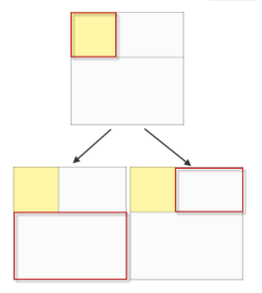

# Rectangle Fitting实验

[TOC]

## 实验要求

给定$N$个矩形$R_1,R_2,...,R_n$，再给定一个矩形$R_0$，需要找到一种放置方式将$N$个矩形放入$R_0$中，并保证这些矩形互相不重叠。


## 基本想法

### SMT

该问题需要三种约束

1. 矩形本身能够竖放或者横放，所以矩形的姿态有两种可能性


2. 矩形我们记录矩形左下顶点的位置，所以在摆放矩形的时候需要保证矩形不超出边框


3. 矩形和矩形之间需要确保不重叠，重叠的判断通过两个矩形的X,Y,W,H来约束，如下图所示


### 自己实现

通过遍历每个长方形的摆放方式，以及放置一个长方形后，原来长方形被切割成的两个部分，来递归尝试放置新的长方形，最终得到可行的摆放解，但是该算法并不能保证一定存在解。



## 代码实现

### SMT

对于三种约束分别建立三个函数来产生三种约束**（完整代码见rectangle_z3.py文件）**

```python
# 约束每个矩形的height和width
def constrain_rec(W, H, rec_dict):
    constrain = []
    for i, info in rec_dict.items():
        constrain.append(Or(
            And(W[i]==info["w"], H[i]==info['h']),
            And(W[i]==info['h'], H[i]==info['w'])
            ))
    return And(constrain)
```

```python
# 约束每个矩形的位置,确保不出最外框的大小
def constrain_loc(X, Y, W, H, outer_rec):
    constrain = []
    for i in range(len(H)):
        constrain.append(And(
            And(X[i]>=0, X[i]+W[i]<=outer_rec['w']),
            And(Y[i]>=0, Y[i]+H[i]<=outer_rec['h']),
            ))
    return And(constrain)
```

```python
# 约束矩形互相位置,确保不重叠
def constrain_overlap(X, Y, W, H):
    constrain = []
    for i in range(len(H)):
        for j in range((len(H))):
            if i != j:
                constrain.append(Or(
                    X[j]>=X[i]+W[i],
                    X[i]>=X[j]+W[j],
                    Y[j]>=Y[i]+H[i],
                    Y[i]>=Y[j]+H[j]
                    ))
    return And(constrain)
```

通过求解该约束问题，就能得到最终的答案。

### 自己实现

关键代码如下，该部分代码通过遍历每个可放置矩形的横放、竖放两种情况，并对放置该矩形之后形成的两个新空矩形进行递归求解，但很不幸，作为NP完全问题，该算法只是一个对fitting问题的近似解。

```python
def fitting(x, y, h, w, recset):
    # 已经没有可摆放的空间
    assert recset is not None
    if x == w or y == h:
        return [], recset
    elif len(recset) == 0:
        return [], None
    for i in recset:
        # 横放
        if x + i[1] <= w and y + i[0] <= h:
            # fitting第一种空间
            res = recset.copy()
            res.pop(res.index(i))
            ans1, res = fitting(x, y+i[0], h, w, res)
            # 如果放置完毕
            if res is None:
                return ans1 + [(x, y, i[1], i[0])], None
            # 对未放放置完毕的rectangle继续放置
            else:
                # print(x+i[1], y)
                ans2, res = fitting(x+i[1], y, y+i[0], w, res.copy())
                # 即使没有放置完毕也可以返回
                return ans1 + ans2 + [(x, y, i[1], i[0])], res

            # fitting第二种空间
            res = recset.copy()
            res.pop(res.index(i))
            ans1, res = fitting(x, y+i[0], h, x+i[1], res)
            # 如果放置完毕
            if res is None:
                return ans1 + [(x, y, i[1], i[0])], None
            # 对未放放置完毕的rectangle继续放置
            else:
                ans2, res = fitting(x+i[1], y, h, w, res.copy())
                # 即使没有放置完毕也可以返回
                return ans1 + ans2 + [(x+i[1], y, i[1], i[0])], res
        # 竖放
        elif x + i[0] <= w and y + i[1] <= h:
            # fitting第一种空间
            res = recset.copy()
            res.pop(res.index(i))
            ans1, res = fitting(x, y+i[1], h, w, res)
            # 如果放置完毕
            if res is None:
                return ans1 + [(x, y, i[0], i[1])], None
            # 对未放放置完毕的rectangle继续放置
            else:
                # print(x+i[0], y)
                ans2, res = fitting(x+i[0], y, y+i[1], w, res.copy())
                # 即使没有放置完毕也可以返回
                return ans1 + ans2 + [(x, y, i[0], i[1])], res

            # fitting第二种空间
            res = recset.copy()
            res.pop(res.index(i))
            ans1, res = fitting(x, y+i[1], h, x+i[0], res)
            # 如果放置完毕
            if res is None:
                return ans1 + [(x, y, i[0], i[1])], None
            # 对未放放置完毕的rectangle继续放置
            else:
                ans2, res = fitting(x+i[0], y, h, w, res.copy())
                # 即使没有放置完毕也可以返回
                return ans1 + ans2 + [(x+i[0], y, i[0], i[1])], res
    return [], recset
```

## 性能比较

测试文件如下

```python
200,450 # 最外围的大框
# 下面的都是需要被fitting的小框
100, 30
40, 60
30, 30
70, 70
100, 50
30, 30
```

通过对两个程序循环运行100000次，比较运行时间，可以得到如下数据

Z3花费:4.679588317871094 s

得到的答案

```python
[X_1 = 0,
 Y_1 = 60,
 H_2 = 60,
 Y_4 = 31,
 X_2 = 0,
 W_2 = 40,
 H_5 = 50,
 Y_6 = 31,
 W_5 = 100,
 Y_2 = 0,
 Y_5 = 10,
 Y_3 = 1,
 X_3 = 141,
 X_5 = 40,
 X_4 = 170,
 X_6 = 140,
 H_1 = 30,
 W_1 = 100,
 H_6 = 30,
 H_4 = 70,
 H_3 = 30,
 W_6 = 30,
 W_4 = 70,
 W_3 = 30]
```

手工算法花费:2.4460158348083496 s

得到的答案

```python
x, y, h, w
(130, 170, 30, 30)
(100, 170, 30, 30)
(0, 170, 100, 30)
(70, 100, 60, 40)
(0, 100, 70, 70)
(0, 0, 50, 100)
```

## 实验总结

自己实现的算法较为复杂，我写了一个下午+一个晚上才能写一个差不多能用的算法，但是使用SMT求解的算法却很简单，而且通俗易懂，可以见到使用SMT算法来减轻人们编写程序的难度是一件很好的事情。

另外使用SMT算法在数据量小的时候可能比不上手工算法，虽然来不及做更大数据量的实验，但是在更大数据量下，SMT求解器使用各种启发式算法，应该会比手工算法速度更快。